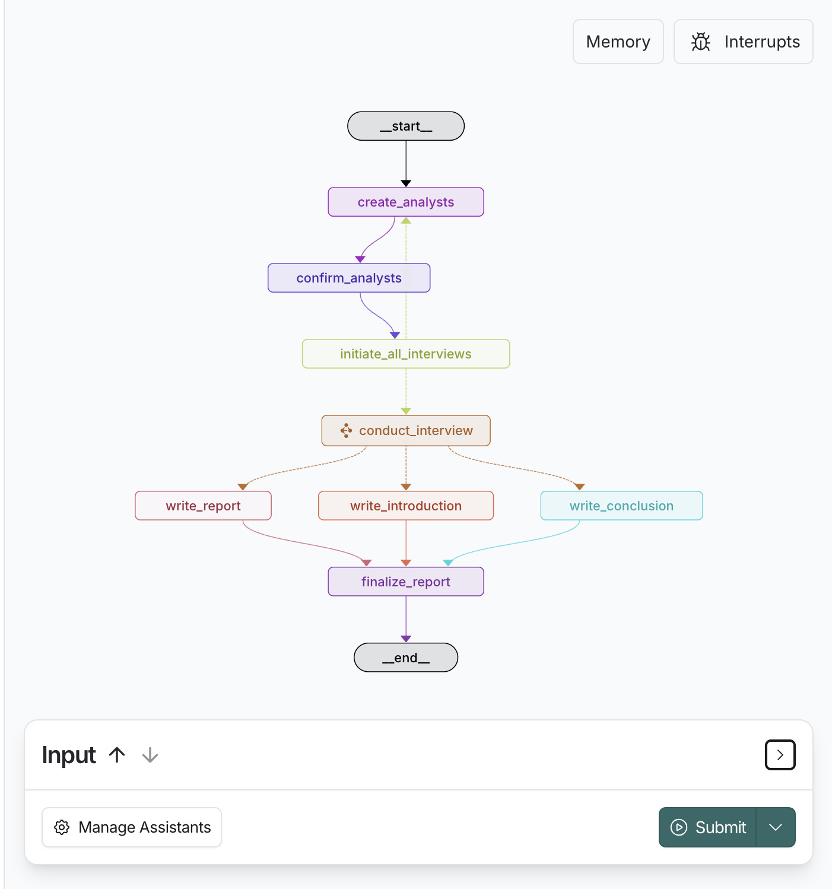
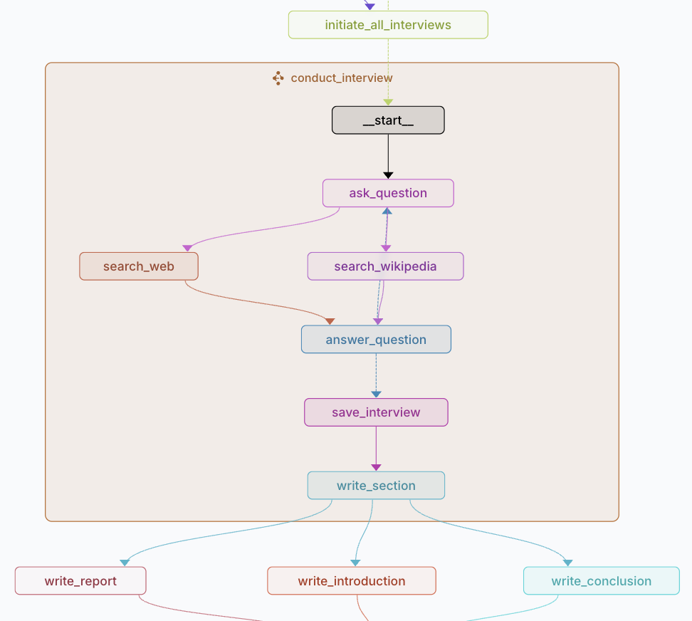

# Deep Research Agent

A LangGraph-powered research agent that conducts deep research on any topic by simulating multiple expert analysts, conducting interviews, and generating comprehensive reports.

## Project Overview

The Deep Research Agent is an AI-powered research tool built with LangGraph that:

1. Creates a team of AI analyst personas with diverse perspectives
2. Conducts simulated interviews with experts on the research topic
3. Searches the web and Wikipedia for relevant information
4. Generates comprehensive research reports with proper citations

## Architecture

The project uses a multi-stage workflow implemented with LangGraph:



The main research flow includes:
- Creating and confirming analyst personas
- Initiating interviews with each analyst
- Generating report components (introduction, content, conclusion)
- Finalizing the complete report

Each interview follows a detailed process:



The interview process includes:
- Asking questions
- Searching for information (web and Wikipedia)
- Generating expert answers
- Saving interview content
- Writing report sections

## Installation

1. Clone the repository:
```bash
git clone https://github.com/Jerryson520/deep-research-agent.git
cd deep-research-agent
```

2. Create a Python virtual environment (Python 3.12+ required):
```bash
python -m venv venv
source venv/bin/activate  # On Windows: venv\Scripts\activate
```

3. Install dependencies:
```bash
pip install -e .
```

4. Set up environment variables:
Create a `.env` file in the project root with your API keys:
```
OPENAI_API_KEY=your_openai_api_key
TAVILY_API_KEY=your_tavily_api_key
```

## Usage

### Running the Agent

You can run the research agent using the LangGraph CLI:

```bash
python -m langgraph.dev src/dr_agent/graph.py
```

This will:
1. Start the LangGraph development server
2. Initialize the research graph
3. Allow you to interact with the agent through the web interface

To run the agent programmatically, you can use the research_graph from the graph.py module:

```python
from src.dr_agent.graph import research_graph

# Initialize with your research topic and number of analysts
config = {"topic": "Your research topic", "max_analysts": 3}
thread_id = {"configurable": {"thread_id": "your_thread_id"}}

# Run the graph
for event in research_graph.stream(config, thread_id, stream_mode="values"):
    # Process events as needed
    print(event)
    
# Get the final report
final_state = research_graph.get_state(thread_id)
report = final_state.values.get('final_report')

# Save the report
with open("report.md", "w", encoding="utf-8") as f:
    f.write(report)
```

### Development Mode

For development and testing:

```bash
langgraph dev src/dr_agent/graph.py
```

This will start a development server that allows you to:
- Visualize the graph execution
- Inspect state at each node
- Debug the flow of information

## Project Structure

- `src/dr_agent/`: Core module containing:
  - `graph.py`: LangGraph workflow definitions and graph creation
  - `nodes.py`: Individual node implementations for each step in the research process
  - `state.py`: State definitions for the graph (ResearchGraphState, InterviewState, etc.)
  - `prompts.py`: System prompts for different agent roles
  - `configuration.py`: Configuration settings for the agent

## Customization

### Changing the LLM Model

You can change the LLM model in `configuration.py`:

```python
model: Annotated[str, {"__template_metadata__": {"kind": "llm"}}] = field(
    default="openai/gpt-4o-mini",  # Change to your preferred model
    metadata={
        "description": "The name of the language model to use for the agent's main interactions. "
        "Should be in the form: provider/model-name."
    },
)
```

### Modifying System Prompts

You can customize the behavior of different components by modifying the prompts in `prompts.py`.

### Extending the Research Process

To add new capabilities to the research process:

1. Define new node functions in `nodes.py`
2. Update the graph structure in `graph.py`
3. Modify state definitions in `state.py` if needed

## License

[Add your license information here]

## Acknowledgments

- Built with [LangGraph](https://github.com/langchain-ai/langgraph)
- Uses [LangChain](https://github.com/langchain-ai/langchain) for LLM interactions
- Powered by OpenAI's models and Tavily search API
